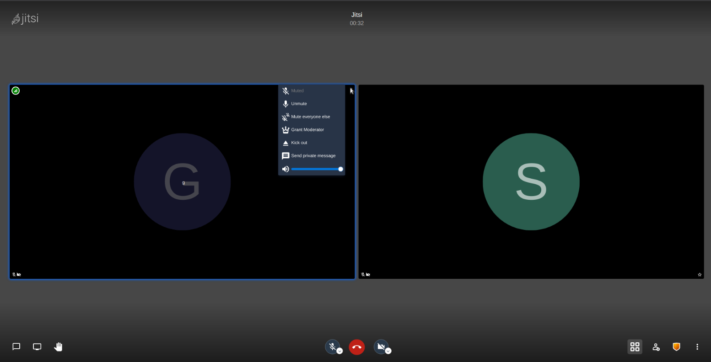

# jitsi-meet-dev

Jitsi Diagram
=============


While the moderator can mute a participant, they cannot unmute the participant due to privacy concerns. Enhancement is required to unmute the remote user. In this project, we will explain how we can add silence feature to the Jitsi-meet project. The repositories that have been modified in the Jitsi Meet project are listed below.

- [1. jicofo repository](#1-jicofo-repository)
- [2. jitsi-meet repository](#2-jitsi-meet-repository)
  - [2.1 Create Unmute Button Component](#2-1-create-unmute-button-component)
  - [2.2 Create Unmute Button Dialog Component](#2-2-create-unmute-button-dialog-component)
  - [2.3 Controls of Unmute ](#2-3-controls-of-unmute)
- [3. lib-jitsi-meet repository](#3-lib-jitsi-meet-repository)

    git clone --branch mute-unmute git@github.com:bayraktarulku/lib-jitsi-meet.git
## 1. jicofo repository
* You can clone the repository the change was made. (line no will be added)
    ```
    apt install maven
    git clone --branch mute-unmute git@github.com:bayraktarulku/jicofo.git
    cd jicofo
    mvn install
    cd target
    mv jicofo-1.1-SNAPSHOT-jar-with-dependencies.jar jicofo.jar
    cp jicofo.jar /usr/share/jicofo/
    /etc/init.d/jicofo restart && /etc/init.d/jitsi-videobridge2 restart && /etc/init.d/prosody restart
    ```
* if you want to do the processing steps yourself

    __Conference focus is mandatory component of Jitsi Meet conferencing system next to the videobridge. To make changes to Jicofo, follow the steps below.__

    * First of all, clone jicofo locally or fork it.
        ```
        apt install maven
        git clone https://github.com/jitsi/jicofo.git
        cd jicofo
        ```
    * Inside the cloned __jicofo__ project, there are the following folders and files;
        * checkstyle.xml
        * debian
        * doc
        * lib
        * LICENSE
        * pom.xml
        * README.md
        * resources
        * script
        * SECURITY.md
        * src
    * To make changes to the __JitsiMeetConferenceImpl.java__ file in the project, go to the location of the file and make the following changes.
        ```
        cd jicofo/src/main/java/org/jitsi/jicofo
        vim JitsiMeetConferenceImpl.java
        ```
    * Edit the following code block in file __JitsiMeetConferenceImpl.java__. Remove this condition or comment (Line: 2422).
        ```
        // do not allow unmuting other participants even for the moderator
        // if (!doMute && !fromJid.equals(toBeMutedJid))
        // {
        //    logger.warn("Blocking an unmute request (jid not the same).");
        //    return false;
        // }
        ```
    * Go to the directory where the __pom.xml__ file is located and perform the __mvn install__ process to create the new jar files.
        ```
        cd ~/jicofo
        mvn install
        ```
    * A target folder will be created after __mvn install__. Inside this folder are java jar files that we will use as compressed.
        * archive-tmp
        * checkstyle-checker.xml
        * classes
        * generated-test-sources
        * jicofo-1.1-SNAPSHOT.jar
        * maven-archiver
        * surefire-reports
        * checkstyle-cachefile
        * checkstyle-result.xml
        * generated-sources
        * jicofo-1.1-SNAPSHOT-archive.zip
        * __jicofo-1.1-SNAPSHOT-jar-with-dependencies.jar__
        * maven-status
        * test-classes
    * We need to replace our new jar file with the old __jicofo.jar__ file.
        ```
        cd target
        mv jicofo-1.1-SNAPSHOT-jar-with-dependencies.jar jicofo.jar
        cp jicofo.jar /usr/share/jicofo/
        ```
    * To restart services after changes;

        ```/etc/init.d/jicofo restart && /etc/init.d/jitsi-videobridge2 restart && /etc/init.d/prosody restart```

    * In order to monitor Jicofo logs;

        ```tail -f /var/log/jitsi/jicofo.log```

## 2. jitsi-meet repository
description will be added!

#### 2.1 Create Unmute Button Component
* First, the unmute feature has been added to the participant's options menu.
    - UnMuteButton && AbstractUnMuteButton classes created
        [UnMuteButton] (https://github.com/bayraktarulku/jitsi-meet/blob/mute-unmute/react/features/remote-video-menu/components/web/UnMuteButton.js)
        [AbstractUnMuteButton] (https://github.com/bayraktarulku/jitsi-meet/blob/mute-unmute/react/features/remote-video-menu/components/AbstractUnMuteButton.js)


    - Export UnMuteButton Component
        ```
        vim react/features/remote-video-menu/components/web/index.js
        ```

        ```
        export { default as UnMuteButton } from './UnMuteButton';
        export { default as UnMuteRemoteParticipantDialog }
        from './UnMuteRemoteParticipantDialog';
        ```

    - UnMuteButton Component added to remoteVideoOptionsMenu
        ```
        vim react/features/remote-video-menu/components/web/RemoteVideoMenuTriggerButton.js
        ```
        - UnMuteButton added import list
        ```
        import {
            GrantModeratorButton,
            MuteButton,
            UnMuteButton,
            MuteEveryoneElseButton,
            KickButton,
            PrivateMessageMenuButton,
            RemoteControlButton,
            RemoteVideoMenu,
            VolumeSlider
        } from './';
        ```

        - added UnMuteButton component to moderator (_renderRemoteVideoMenu() -> if(_isModerator))

        ```
        buttons.push(
            <UnMuteButton
                isAudioMuted = { isAudioMuted }
                key = 'unmute'
                participantID = { participantID } />
        );
        ```
        

#### 2.2 Create Unmute Button Dialog Component
* Create AbstractUnMuteRemoteParticipantDialog. Then include it in the UnMuteRemoteParticipantDialog class.
    ```
    react/features/remote-video-menu/components/AbstractUnMuteRemoteParticipantDialog.js
    ```
    ```
    vim react/features/remote-video-menu/components/web/UnMuteRemoteParticipantDialog.js
    ```
    ```
    class UnMuteRemoteParticipantDialog extends AbstractUnMuteRemoteParticipantDialog {
        /**
            * Implements React's {@link Component#render()}.
            *
            * @inheritdoc
            * @returns {ReactElement}
            */
        render() {
            return (
                <Dialog
                    okKey = 'dialog.unMuteParticipantButton'
                    onSubmit = { this._onSubmit }
                    titleKey = 'dialog.unMuteParticipantTitle'
                    width = 'small'>
                    <div>
                        { this.props.t('dialog.unMuteParticipantBody') }
                    </div>
                </Dialog>
            );
        }

        _onSubmit: () => boolean;
    }
    ```

    

#### 2.3 Controls of Unmute
* Method created for unmute option __unMuteRemoteParticipant__ imported.
    ```
    vim react/features/remote-video-menu/action.js
    ```
    ```
    import {
        unMuteRemoteParticipant
    } from '../base/participants';
    ```
    ```
    export function unMuteRemote(participantId: string) {
        return (dispatch: Dispatch<any>) => {
            sendAnalytics(createRemoteMuteConfirmedEvent(participantId));
            dispatch(unMuteRemoteParticipant(participantId));
        };
    }
    ```
* Added const variable -> UNMUTE_REMOTE_PARTICIPANT.
    ```
    vim react/features/base/participants/actionTypes.js
    ```
    ```
    export const UNMUTE_REMOTE_PARTICIPANT = 'UNMUTE_REMOTE_PARTICIPANT';
    ```
* This option import list added.
    ```
    vim react/features/base/participants/actions.js
    ```
    ```
    import {
        UNMUTE_REMOTE_PARTICIPANT,
    }

    export function unMuteRemoteParticipant(id) {
        return {
            type: UNMUTE_REMOTE_PARTICIPANT,
            id
        };
    }
    ```
* Created new case (UNMUTE_REMOTE_PARTICIPANT).
    ```
    vim react/features/base/participants/middleware.js
    ```
    ```
    import {
        UNMUTE_REMOTE_PARTICIPANT,
    }

    case UNMUTE_REMOTE_PARTICIPANT: {
        const { conference } = store.getState()['features/base/conference'];
        conference.unMuteParticipant(action.id);
        break;
    }
    ```
## 3. lib-jitsi-meet repository
* Added new event for AUDIO_UNMUTED_BY_FOCUS.
    ```
    vim service/xmpp/XMPPEvents.js
    ```
    ```
    AUDIO_UNMUTED_BY_FOCUS: 'xmpp.audio_unmuted_by_focus'
    ```
* Created event listener for AUDIO_UNMUTED_BY_FOCUS.
    ```
    vim JitsiConferenceEventManager.js
    ```
    ```
    chatRoom.addListener(XMPPEvents.AUDIO_UNMUTED_BY_FOCUS,
        actor => {
            // TODO: Add a way to differentiate between commands which caused
            // us to mute and those that did not change our state (i.e. we were
            // already muted).
            Statistics.sendAnalytics(createRemotelyMutedEvent());

           // conference.mutedByFocusActor = actor;

            // set isMutedByFocus when setAudioMute Promise ends
            conference.rtc.setAudioMute(false).then(
                () => {
                    conference.isMutedByFocus = false;
                    conference.mutedByFocusActor = null;
                })
                .catch(
                    error => {
                        conference.mutedByFocusActor = null;
                        logger.warn(
                            'Error while audio unmuting due to focus request', error);
                });
        }
    );
    ```
* Added prototype for unMuteParticipant.
    ```
    vim JitsiConference.js
    ```
    ```
    JitsiConference.prototype.unMuteParticipant = function(id) {
        const participant = this.getParticipantById(id);

        if (!participant) {
            return;
        }
        this.room.muteParticipant(participant.getJid(), false);
    };
    ```
* Added unMuteParticipant method and changed onMute method.
    ```
    vim modules/xmpp/ChatRoom.js
    ```
    ```
    unMuteParticipant(jid, mute) {
        logger.info('set unmute', mute);
        const iqToFocus = $iq(
            { to: this.focusMucJid,
                type: 'set' })
            .c('mute', {
                xmlns: 'http://jitsi.org/jitmeet/audio',
                jid
            })
            .t(mute.toString())
            .up();

        this.connection.sendIQ(
            iqToFocus,
            result => logger.log('set mute', result),
            error => logger.log('set mute error', error));
    }
    ```
    ```
    onMute(iq) {
        const from = iq.getAttribute('from');
        if (from !== this.focusMucJid) {
            logger.warn('Ignored mute from non focus peer');

            return;
        }
        const mute = $(iq).find('mute');
        if (mute.length && mute.text() === 'true') {
            this.eventEmitter.emit(XMPPEvents.AUDIO_MUTED_BY_FOCUS, mute.attr('actor'));
        } else if (mute.length && mute.text() === 'false') { // added unmute condition
        this.eventEmitter.emit(XMPPEvents.AUDIO_UNMUTED_BY_FOCUS, mute.attr('actor'));
        } else {
                // XXX Why do we support anything but muting? Why do we encode the
                // value in the text of the element? Why do we use a separate XML
                // namespace?
                logger.warn('Ignoring a mute request which does not explicitly '
                    - 'specify a positive mute command.');
        }
    }
    ```


#### Contributors

[Seda Çağlar](https://github.com/sdcaglar)
